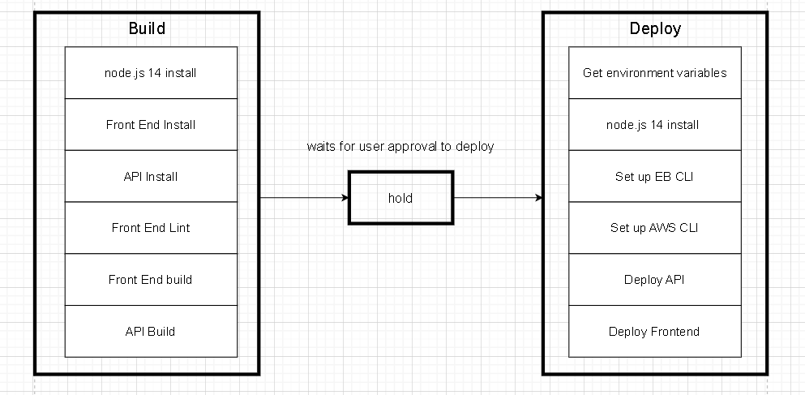

# Pipeline process

The pipeline process is handled by CircleCI. CircleCI implements the pipeline according to the config.yml file present in the .circleci folder in the root directory of the project

the following picture shows the complete pipeline process

## build

In the build process, several steps is involved in the process. First the required node version should be installed. Then we install front end dependencies and the api after. then we lint the frontend code and after that we build the frontend and the api

## hold

hold is added to make sure we want to deploy so its function is to stop the next step until it is approved by a human

## deploy

to deploy all the required environments should be present like AWS CLI node.js 14 and EB CLI and their dependencies. After their installations the api is deployed then the frontend
